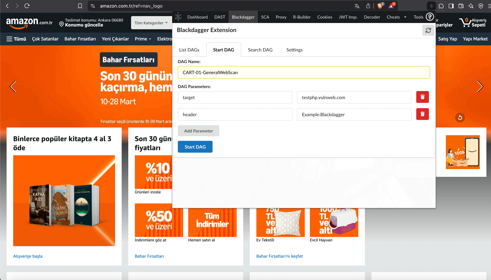

# Blackdagger Penetration Testing Kit (BPTK)


The Blackdagger Penetration Testing Kit (BPTK) browser extension is a sophisticated, enhanced version of the OWASP Penetration Testing Kit, designed specifically for Red Team operations and advanced penetration testing workflows. Leveraging GitHub Actions runners, BPTK performs dynamic application security testing (DAST) without triggering common web defenses or IP-based blocking mechanisms, significantly improving operational security (OPSEC).

## Key Features

### GitHub Runner-Powered DAST Scanning

BPTK revolutionizes traditional DAST by leveraging GitHub Actions runners, significantly enhancing operational security (OPSEC). This method allows penetration testers and Red Team operators to perform scans and execute simulated attacks from GitHub's trusted infrastructure, thereby reducing the likelihood of detection by web defenses and IP-based blocking mechanisms. By simply forking the provided default GitHub repository and configuring your GitHub token within the BPTK DAST settings, you ensure stealthy, uninterrupted, and effective security testing with minimized risk of alerting defensive measures or leaving traceable digital footprints.


### Integration with the Blackdagger System





Seamlessly integrates with the comprehensive Blackdagger continuous red team operations framework. Initiate scans, manage complex multi-step attack scenarios, and leverage external security tools beyond browser-based capabilities, expanding your tactical reach.

Blackdagger represents a significant advancement in automation technology, offering a comprehensive solution for orchestrating complex workflows in DevOps, DevSecOps, MLOps, MLSecOps, and Continuous Automated Red Teaming (CART) environments. At its core, Blackdagger simplifies the management and execution of intricate workflows through its user-friendly approach and powerful functionality. Leveraging a declarative YAML format, Blackdagger enables users to define automation pipelines using a Directed Acyclic Graph (DAG), clearly expressing task dependencies and execution logic without extensive scripting or coding.

With a built-in Web UI, users can easily manage, rerun, and monitor automation pipelines in real-time, significantly streamlining the workflow management process. Additionally, Blackdagger's native Docker support ensures seamless integration with containerized environments, and its versatile toolset allows task execution via HTTP requests and SSH commands. This integration enhances your tactical reach, simplifying complex multi-step attack scenarios, and enables you to leverage external security tools effectively, ensuring comprehensive and robust operations.


### JWT Inspector 

Easily analyze JSON Web Tokens (JWT), build and manipulate tokens, and generate cryptographic key pairs directly within your browser.

### Application Insight


One-click comprehensive intelligence, including:

- Technology stack identification
- Web Application Firewall (WAF) detection
- Security header analysis
- Crawled link visualization
- Authentication flow inspection
- Software Composition Analysis (SCA) scanning right within your browser 

### Integrated Proxy with Traffic Logging


A robust proxy with detailed logging, allowing you to replay requests or seamlessly forward them to the integrated DAST tool for automated exploitation.

### R-Builder for Advanced Request Manipulation

Craft, modify, and tamper HTTP requests precisely to test application resilience. R-Builder supports complex attacks including HTTP request smuggling for thorough security assessments.

### Cookie Management


Effectively manage cookies with features to add, edit, block, protect, import, and export.

### Encoder/Decoder Utility

Convert and handle data across formats such as UTF-8, Base64, MD5, and more directly in your browser.

### Swagger.IO API Integration

Enhanced API documentation handling through integrated Swagger.IO, allowing seamless interactions with API endpoints.

### Selenium Integration

Identify and remediate security issues early in development by automating browser actions and integrating security checks directly into your development lifecycle.


## Installation and Development

### Clone and Build

```bash
git clone https://github.com/ErdemOzgen/blackdagger-web-kit.git
cd blackdagger-web-kit
npm install
npm run build
```

For Chrome/Edge/Brave:

1. Navigate to `Extensions`.
2. Enable `Developer Mode`.
3. Click on `Load unpacked` and select `blackdagger-web-kit/src` directory.

Alternatively, create a packaged version:

```bash
npm run build_pkg
```

This generates a ZIP archive in the `pentestkit/dist` folder.

**Note for Windows Users:**
If encountering build errors, run:

```bash
npm install --ignore-scripts fomantic-ui
```

## Installation Links

Official web extension links will be updated upon release. Meanwhile, download and build from the repository:

- [Firefox](https://github.com/ErdemOzgen/blackdagger-web-kit)
- [Chrome](https://github.com/ErdemOzgen/blackdagger-web-kit)

Take your penetration testing and Red Team operations to the next level with the enhanced security capabilities of the Blackdagger Penetration Testing Kit (BPTK).

